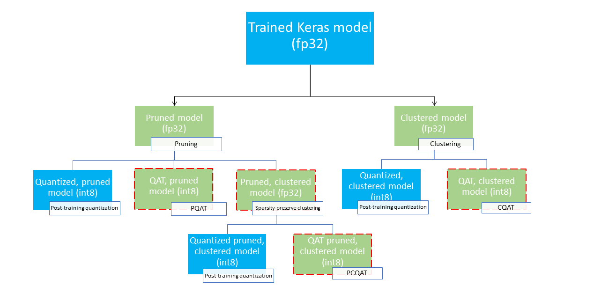
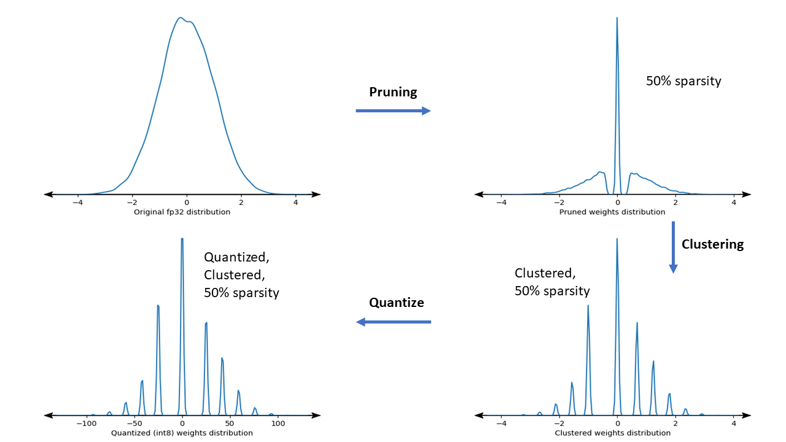

# Collaborative Optimization

Maintained by Arm ML Tooling

This document provides an overview of experimental APIs for combining various
techniques to optimize machine learning models for deployment.

## Overview

Collaborative optimization is an overarching process that encompasses various
techniques to produce a model that, at deployment, exhibits the best balance of
target characteristics such as inference speed, model size and accuracy.

The idea of collaborative optimizations is to build on individual techniques by
applying them one after another to achieve the accumulated optimization effect.
Various combinations of the following optimizations are possible:

*   [Weight pruning](https://medium.com/tensorflow/tensorflow-model-optimization-toolkit-pruning-api-42cac9157a6a)
*   [Weight clustering](https://blog.tensorflow.org/2020/08/tensorflow-model-optimization-toolkit-weight-clustering-api.html)
*   Quantization

    *   [Post-training quantization](https://medium.com/tensorflow/tensorflow-model-optimization-toolkit-post-training-integer-quantization-b4964a1ea9ba)
    *   [Quantization aware training](https://blog.tensorflow.org/2020/04/quantization-aware-training-with-tensorflow-model-optimization-toolkit.html)
        (QAT)

The issue that arises when attempting to chain these techniques together is that
applying one typically destroys the results of the preceding technique, spoiling
the overall benefit of simultaneously applying all of them; for example,
clustering doesn't preserve the sparsity introduced by the pruning API. To solve
this problem, we introduce the following experimental collaborative optimization
techniques:

*   [Sparsity preserving clustering](https://www.tensorflow.org/model_optimization/guide/combine/sparse_clustering_example)
*   [Sparsity preserving quantization aware training](https://www.tensorflow.org/model_optimization/guide/combine/pqat_example)
    (PQAT)
*   [Cluster preserving quantization aware training](https://www.tensorflow.org/model_optimization/guide/combine/cqat_example)
    (CQAT)
*   [Sparsity and cluster preserving quantization aware training](https://www.tensorflow.org/model_optimization/guide/combine/pcqat_example)

These provide several deployment paths that could be used to compress a machine
learning model and to take advantage of hardware acceleration at inference time.
The diagram below demonstrates several deployment paths that can be explored in
search for the model with desired deployment characteristics, where the leaf
nodes are deployment-ready models, meaning they are partially or fully quantized
and in tflite format. The green fill indicates steps where
retraining/fine-tuning is required and a dashed red border highlights the
collaborative optimization steps. The technique used to obtain a model at a
given node is indicated in the corresponding label.

The direct, quantization-only (post-training or QAT) deployment path is omitted
in the figure above.

The idea is to reach the fully optimized model at the third level of the above
deployment tree; however, any of the other levels of optimization could prove
satisfactory and achieve the required inference latency/accuracy trade-off, in
which case no further optimization is needed. The recommended training process
would be to iteratively go through the levels of the deployment tree applicable
to the target deployment scenario and see if the model fulfils the inference
latency requirements and, if not, use the corresponding collaborative
optimization technique to compress the model further and repeat until the model
is fully optimized (pruned, clustered, and quantized), if needed.

The figure below shows the density plots of sample weight kernel going through
the collaborative optimization pipeline.

The result is a quantized deployment model with a reduced number of unique
values as well as a significant number of sparse weights, depending on the
target sparsity specified at training time. Other than the significant model
compression advantages, specific hardware support can take advantage of these
sparse, clustered models to significantly reduce inference latency.

## Results

Below are some accuracy and compression results we obtained when experimenting
with PQAT and CQAT collaborative optimization paths.

### Sparsity-preserving Quantization aware training (PQAT)

<figure>
<table class="tableizer-table">
<tr class="tableizer-firstrow"><th>Model</th><th>Items</th><th>Baseline</th><th>Pruned Model (50% sparsity)</th><th>QAT Model</th><th>PQAT Model</th></tr>
 <tr><td>DS-CNN-L</td><td>FP32 Top1 Accuracy</td><td><b>95.23%</b></td><td>94.80%</td><td>(Fake INT8) 94.721%</td><td>(Fake INT8) 94.128%</td></tr>
 <tr><td>&nbsp;</td><td>INT8 full integer quantization</td><td>94.48%</td><td><b>93.80%</b></td><td>94.72%</td><td><b>94.13%</b></td></tr>
 <tr><td>&nbsp;</td><td>Compression</td><td>528,128 → 434,879 (17.66%)</td><td>528,128 → 334,154 (36.73%)</td><td>512,224 → 403,261 (21.27%)</td><td>512,032 → 303,997 (40.63%)</td></tr>
 <tr><td>Mobilenet_v1-224</td><td>FP32 Top 1 Accuracy</td><td><b>70.99%</b></td><td>70.11%</td><td>(Fake INT8) 70.67%</td><td>(Fake INT8) 70.29%</td></tr>
 <tr><td>&nbsp;</td><td>INT8 full integer quantization</td><td>69.37%</td><td><b>67.82%</b></td><td>70.67%</td><td><b>70.29%</b></td></tr>
 <tr><td>&nbsp;</td><td>Compression</td><td>4,665,520 → 3,880,331 (16.83%)</td><td>4,665,520 → 2,939,734 (37.00%)</td><td>4,569,416 → 3,808,781 (16.65%)</td><td>4,569,416 → 2,869,600 (37.20%)</td></tr>
</table>
</figure>

### Cluster-preserving Quantization aware training (CQAT)

<figure>
<table class="tableizer-table">
<tr class="tableizer-firstrow"><th>Model</th><th>Items</th><th>Baseline</th><th>Clustered Model</th><th>QAT Model</th><th>CQAT Model</th></tr>
 <tr><td>Mobilenet_v1 on CIFAR-10</td><td>FP32 Top1 Accuracy</td><td><b>94.88%</b></td><td>94.48%</td><td>(Fake INT8) 94.80%</td><td>(Fake INT8) 94.60%</td></tr>
 <tr><td>&nbsp;</td><td>INT8 full integer quantization</td><td>94.65%</td><td><b>94.41%</b></td><td>94.77%</td><td><b>94.52%</b></td></tr>
 <tr><td>&nbsp;</td><td>Size</td><td>3.00 MB</td><td>2.00 MB</td><td>2.84 MB</td><td>1.94 MB</td></tr>
 <tr><td>Mobilenet_v1 on ImageNet</td><td>FP32 Top 1 Accuracy</td><td><b>71.07%</b></td><td>65.30%</td><td>(Fake INT8) 70.39%</td><td>(Fake INT8) 65.35%</td></tr>
 <tr><td>&nbsp;</td><td>INT8 full integer quantization</td><td>69.34%</td><td><b>60.60%</b></td><td>70.35%</td><td><b>65.42%</b></td></tr>
 <tr><td>&nbsp;</td><td>Compression</td><td>4,665,568 → 3,886,277 (16.7%)</td><td>4,665,568 → 3,035,752 (34.9%)</td><td>4,569,416 → 3,804,871 (16.7%)</td><td>4,569,472 → 2,912,655 (36.25%)</td></tr>
</table>
</figure>

### CQAT and PCQAT results for models clustered per channel
Results below are obtained with the technique [clustering per channel](https://www.tensorflow.org/model_optimization/guide/clustering).
They illustrate that if convolutional layers of the model are clustered per channel, then the model accuracy is higher. If your model has many convolutional layers, then we recommend to cluster per channel. The compression ratio remains the same, but the model accuracy will be higher. The model optimization pipeline is 'clustered -> cluster preserving QAT -> post training quantization, int8' in our experiments.
<figure>
<table  class="tableizer-table">
<tr class="tableizer-firstrow"><th>Model</th><th>Clustered -> CQAT, int8 quantized</th><th>Clustered per channel -> CQAT, int8 quantized</th>
 <tr><td>DS-CNN-L</td><td>95.949%</td><td> 96.44%</td></tr>
 <tr><td>MobileNet-V2</td><td>71.538%</td><td>72.638%</td></tr>
 <tr><td>MobileNet-V2 (pruned)</td><td>71.45%</td><td>71.901%</td></tr>
</table>
</figure>

## Examples

For end-to-end examples of the collaborative optimization techniques described
here, please refer to the
[CQAT](https://www.tensorflow.org/model_optimization/guide/combine/cqat_example),
[PQAT](https://www.tensorflow.org/model_optimization/guide/combine/pqat_example),
[sparsity-preserving clustering](https://www.tensorflow.org/model_optimization/guide/combine/sparse_clustering_example),
and
[PCQAT](https://www.tensorflow.org/model_optimization/guide/combine/pcqat_example)
example notebooks.
